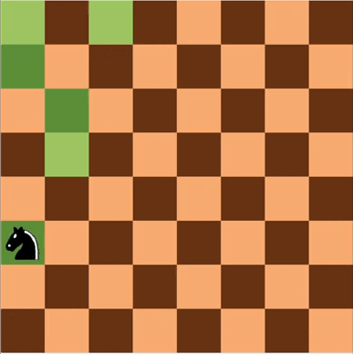
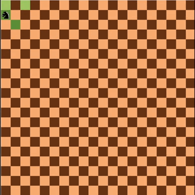
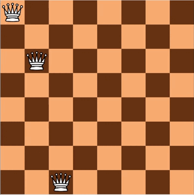

# Knight's Tour Problem

The Knight's Tour problem consists of an *N × N* chessboard and a knight piece. The goal is to find a sequence of knight moves that visits every tile on the board **exactly once**.

## Warnsdorff's Rule

Warnsdorff's rule is a heuristic used to improve the efficiency of backtracking solutions to the Knight's Tour problem. It is named after H. C. Warnsdorff, who introduced the rule in the 19th century.

The idea behind the rule is to prioritize moves based on the number of onward moves available from each potential next square. In other words, the knight should always move to the square from which it has the **fewest onward moves**, reducing the chances of reaching a dead end later.

## Results

Comparing the solution with and without Warnsdorff's optimization clearly shows how this heuristic allows the tour to complete much faster. The visualization also provides a helpful way to understand how backtracking works, which is particularly useful when teaching the stack ADT.

The space complexity of this solution is **O(N²)**, as it uses an *N × N* boolean matrix to track visited tiles and an adjacency list to map each move to the tiles it must avoid to prevent revisiting or reaching dead ends.

  
  

# N Queens

The N Queens problem generalizes the classic 8 Queens puzzle. A solution requires placing **N queens on an *N × N* chessboard** such that no two queens attack each other. This program provides an iterative solution to the problem using the stack ADT.

## Approach

The problem is solved in a non-deterministic manner due to its NP-complete nature. The algorithm “guesses” possible queen placements and only advances when valid positions are available in the next column.

A boolean *N × N* matrix is used to store the validity of previous attempts. A custom stack ADT, where each element represents a queen with its row and column, is used to track the current configuration. The program continues pushing queens onto the stack until a column has no remaining valid tiles. When this occurs, the most recently placed queen (in column *i*) is popped, its position is marked invalid in the matrix, and all tiles in columns *i + 1* and beyond are reset to valid (since new placements in earlier columns may change future possibilities). The process continues until a full valid configuration is found. The space complexity of this solution is **O(N²)**.

## Results

  
  

## Credits

* [mbaranr](https://github.com/mbaranr) – Code  
* [DaGeRe](https://github.com/DaGeRe) – Theory
